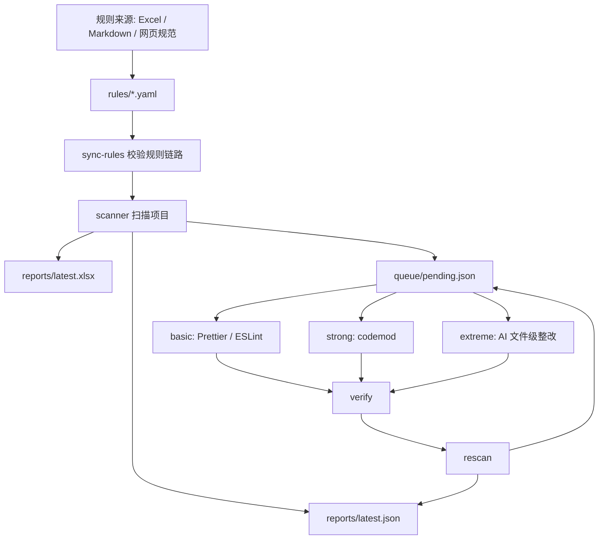

# lhm-code-remediation 小组分享稿

`lhm-code-remediation` 是一个面向存量 Vue + JavaScript 项目的代码规约扫描与分级整改 skill。它可以扫描指定项目的规约问题，生成 JSON 队列和 Excel 报告，也可以按风险从低到高分阶段整改扫描出来的问题。

它不是“让 AI 自动乱改代码”的工具，而是一个规则驱动的整改流水线。核心原则是：

```txt
能用 Prettier / ESLint 解决的，不写 codemod。
能用 codemod 机械解决的，不交给 AI。
只有需要理解上下文和业务语义的问题，才进入 AI 文件级整改。
```

## 三种整改模式

### basic

`basic` 是最低风险模式，主要通过 Prettier / ESLint 等前端工具处理代码格式和可自动修复的 lint 问题。

适合处理：

- 缩进、空格、引号、尾逗号等格式问题。
- ESLint 已经支持 `--fix` 的问题。
- 第一次接入项目时的低风险清理。

这类问题通常数量最多，但风险最低，因为它们不应该改变业务语义。

### strong

`strong` 在 `basic` 基础上增加 codemod 整改。它用于处理 ESLint 无法自动修复、但规则稳定且可以通过 AST 机械修改的问题。

适合处理：

- 删除或替换 `console`。
- `var` 转 `let` / `const`。
- 简单 import 清理。
- 参数和返回语义不变的固定 API 迁移。

codemod 脚本放在 `codemods/utils/` 下，按问题 id 命名。每个问题对应一个独立文件，便于审查、复用和回滚。

### extreme

`extreme` 在 `strong` 基础上增加 AI 文件级整改。它处理剩余的复杂问题，例如大函数、深层嵌套、重复逻辑、参数过多等。

AI 处理不是全项目一次性重写，而是：

- 按文件聚合任务。
- 每批处理少量文件。
- 使用 `ai/prompts/` 下对应问题类型的专用 prompt。
- 每个批次后执行 verify。
- 一轮结束后 rescan，用新报告判断问题是否下降。

如果复扫后问题数没有下降，或验证失败，就停止继续自动处理，把问题记录到 failed/manual 队列。

## 这个 skill 实现了一个可持续的工作流

```txt
规范文档 / Excel
-> rules 草案
-> 人工确认
-> rules/*.yaml
-> scanner / fixer / prompt / verify
-> scan
-> basic / strong / extreme
-> verify
-> rescan
-> JSON 队列 + Excel 报告
```

核心思想是：规则先行，修复分层，验证闭环，小批次推进。

## 适用场景

适合使用这个 skill 的场景：

- 老项目准备接入统一代码规范。
- 需要生成代码质量 baseline 报告。
- 需要把 Excel / Markdown / 网页规范转为可执行规则。
- 需要批量清理格式、lint、console、var/let、简单 API 迁移等问题。
- 需要把大函数、深层嵌套、重复逻辑等问题分批交给 AI 做文件级重构。
- 需要给团队或管理侧输出 Excel 审计报告。
- 需要持续复扫，确认问题数量下降且没有引入新错误。

不适合使用的场景：

- 临时修一个业务 bug。
- 只想让 AI 顺手优化一个文件。
- 没有规则来源，也没有人工确认流程。
- 无法运行验证，或者无法接受失败后转人工。
- 希望一次性全项目大重构。

## 目录结构

当前核心目录可以按“规则、扫描、修复、验证、报告”来理解：

```txt
lhm-code-remediation/
├── SKILL.md                  # Agent 执行规约：什么时候启用、怎么选模式、怎么验证和汇报
├── readme.md                 # 面向团队的介绍和使用说明，也就是当前这篇分享稿
├── package.json              # skill 自身的 Node 依赖和测试 / 扫描 / 同步脚本入口
├── scanner/                  # 扫描层：把代码问题扫描成结构化任务
│   ├── eslint.config.js      # skill 内置 ESLint 扫描配置
│   ├── prettier.config.js    # skill 内置 Prettier 配置
│   ├── scan-eslint.js        # ESLint 扫描入口
│   ├── scan-styleguide.js    # 规约扫描入口
│   ├── generated-eslint-rules.js
│   │                          # 由 rules 同步生成的 ESLint 规则片段
│   └── generated-rule-metadata.json
│                              # 由 rules 同步生成的规则元数据
├── rules/                    # 规则事实源：正式规则从这里开始
│   ├── README.md             # rules 目录约定
│   ├── schema.json           # 规则 YAML 的结构校验 schema
│   └── drafts/               # 新规则草案区，人工确认后再进入正式 rules
├── codemods/                 # 机械修复层：沉淀低风险 AST 转换
│   ├── README.md             # codemod 编写约定
│   ├── registry.yaml         # 可执行 codemod 注册表
│   └── utils/                # 正式 codemod 脚本或说明，一个规则一个文件
├── ai/                       # AI 文件级整改层：只处理语义类问题
│   ├── README.md             # AI 整改边界和 prompt 约定
│   ├── prompt-registry.yaml  # prompt 注册表，绑定 rule 和 prompt 文件
│   └── prompts/              # 正式 prompt，一类问题一个文件
├── verifier/                 # 验证策略层
│   └── registry.yaml         # 验证 profile 注册表，例如 eslint / typecheck / build
├── pipelines/                # 流水线入口：扫描、修复、验证、复扫都从这里调用
│   ├── command.js            # 统一命令入口：scan/basic/strong/extreme/verify/status
│   ├── scan.js               # 扫描并生成报告、队列和 Excel
│   ├── run.js                # workflow 调度入口
│   ├── auto-fix.js           # basic 阶段：Prettier / ESLint 自动修复
│   ├── codemod-fix.js        # strong 阶段：执行已登记 codemod
│   ├── ai-fix.js             # extreme 阶段：AI 文件级批处理
│   ├── verify.js             # 验证入口
│   ├── rescan.js             # 复扫入口
│   └── sync-rules.js         # 校验 rules 到 scanner/codemod/prompt/verify 的链路
├── workflows/                # 分级整改策略
│   ├── basic.yaml            # basic 策略：只做格式和 lint 自动修复
│   ├── strong.yaml           # strong 策略：basic + codemod
│   ├── extreme.yaml          # extreme 策略：strong + AI 小批次
│   └── workflow.schema.json  # workflow 配置 schema
├── scripts/                  # 辅助脚本
│   ├── generate-excel.py     # 生成 Excel 报告
│   ├── merge-results.js      # 合并扫描结果
│   ├── group-by-file.js      # 按文件聚合任务
│   ├── report-delta.js       # 生成趋势对比报告
│   ├── suggest-next-batch.js # 只读报告，推荐下一批处理目标
│   └── validate-report.js    # 校验报告结构
├── reports/                  # 报告模板，不是运行产物目录
│   └── templates/            # Excel 列定义和 report schema
├── references/               # 设计细节和操作边界
│   ├── preflight-policy.md   # 执行前能力检查和工作区检查
│   ├── dependency-policy.md  # Node / Python / 项目依赖策略
│   ├── failure-handling.md   # 失败、回滚、转人工策略
│   ├── operation-guide.md    # 运行操作手册
│   └── platform-support.md   # macOS / Linux / Windows 支持说明
├── evals/                    # 行为级评估用例
└── tests/                    # skill 自身测试，不是目标业务项目测试
```

重点文件可以这样讲：

- `SKILL.md`：给 Agent 看的操作规约，决定什么时候启用 skill。
- `rules/schema.json`：规则结构契约，避免规则写成不可执行的散文。
- `pipelines/command.js`：统一入口，避免不同人临时拼不同命令。
- `pipelines/scan.js`：把代码问题转成 JSON 队列和 Excel 报告。
- `pipelines/run.js`：按 workflow 调度 basic / strong / extreme。
- `pipelines/sync-rules.js`：校验 rule、codemod、prompt、verify 是否连成闭环。
- `codemods/registry.yaml`：codemod 的执行白名单。
- `ai/prompt-registry.yaml`：AI prompt 的执行白名单。
- `workflows/basic.yaml`、`workflows/strong.yaml`、`workflows/extreme.yaml`：三种整改强度的策略边界。
- `references/preflight-policy.md`：执行前检查哪些条件。
- `references/failure-handling.md`：失败时怎么记录、回滚和转人工。

## basic / strong / extreme 的工作流

### basic 工作流

```txt
scan
-> prettier --write
-> eslint --fix
-> verify
-> rescan
-> report
```

`basic` 的目标是建立第一层信任：工具能跑、报告能出、问题能下降、代码不坏。

### strong 工作流

```txt
basic
-> codemod-fix
-> verify
-> rescan
-> report
```

`strong` 只执行已经登记在 `codemods/registry.yaml` 中的 codemod。没有登记的脚本不会被自动执行。

### extreme 工作流

```txt
strong
-> 读取 queue/pending.json 中的 AI 类任务
-> 按文件分组
-> 每批处理少量文件
-> verify
-> rescan
-> 判断是否继续
```

`extreme` 的重点不是“更猛”，而是“更谨慎”：小批量、可验证、可回滚、无下降就停止。

## 怎么使用

### 只扫描不整改

可以直接对 Agent 说：

```txt
使用 lhm-code-remediation 这个 skill 扫描当前项目，不做整改。
```

也可以直接运行命令：

```bash
node <skill-root>/pipelines/command.js scan --target src --output .lhm-code-remediation
```

扫描后重点看这些产物：

```txt
.lhm-code-remediation/reports/latest.json
.lhm-code-remediation/reports/latest.xlsx
.lhm-code-remediation/queue/pending.json
```

其中：

- `latest.json` 给机器读取。
- `latest.xlsx` 给人工审计、管理汇报和手动分析。
- `pending.json` 是后续整改任务的事实源。

### low-risk 整改：basic

可以对 Agent 说：

```txt
使用 lhm-code-remediation 的 basic 模式对当前项目进行整改。
```

命令形式：

```bash
node <skill-root>/pipelines/command.js basic --target src --output .lhm-code-remediation
```

建议第一次执行前先 dry-run：

```bash
node <skill-root>/pipelines/command.js basic --target src --output .lhm-code-remediation --dry-run
```

### 中等强度整改：strong

可以对 Agent 说：

```txt
使用 lhm-code-remediation 的 strong 模式对当前项目进行整改。
```

命令形式：

```bash
node <skill-root>/pipelines/command.js strong --target src --output .lhm-code-remediation
```

`strong` 会先包含 `basic` 能做的事情，再执行已登记 codemod。

### AI 文件级整改：extreme

可以对 Agent 说：

```txt
使用 lhm-code-remediation 的 extreme 模式对当前项目进行整改。
```

命令形式：

```bash
node <skill-root>/pipelines/command.js extreme --target src --output .lhm-code-remediation --batch-size 3 --max-rounds 10
```

如果只说：

```txt
使用 lhm-code-remediation 整改当前项目。
```

Agent 应该先列出 `basic`、`strong`、`extreme` 三种模式，让使用者选择，不应该直接开始修改代码。

### 查看状态和单独验证

查看当前报告和队列：

```bash
node <skill-root>/pipelines/command.js status --output .lhm-code-remediation
```

只运行验证：

```bash
node <skill-root>/pipelines/command.js verify --target src --output .lhm-code-remediation
```

## 怎么补充规则

规则是整个系统的事实源。扫描、codemod、AI prompt、验证策略都要能追溯到某条 rule。

### 从 Excel / 文档生成规则草案

把规则文档放到 `rules/drafts/` 下，然后可以让 Agent 做第一轮识别：

```txt
根据 rules/drafts/ 目录下的 Excel 文件生成对应规则草案。
```

多个 Excel 文件或 Excel 规范初始化时，常见字段包括：

- 规则名称。
- 规则描述。
- 问题等级。
- 正确示例。
- 错误示例。
- 适用语言或文件类型。
- 是否可自动修复。
- 期望修复方式。

第一轮识别时，AI 可以先帮忙分类：

- 适合 Prettier / ESLint 的规则。
- 适合 codemod 的规则。
- 适合 AI 文件级整改的规则。
- 必须 manual 人工处理的规则。

但这个分类不能直接算最终结论，需要人工确认。尤其是 AI 类规则，必须确认它确实需要语义理解，且能通过验证控制风险。

### 新增规则步骤

1. 从 Excel、Markdown、网页规范或团队文档确认规则来源。
2. 先写入 `rules/drafts/` 草案，不直接覆盖正式规则。
3. 人工确认规则名称、规则描述、问题等级、正确示例、错误示例、适用范围、风险和修复方式。
4. 把确认后的规则移动到正式 `rules/*.yaml`。
5. 运行 `node <skill-root>/pipelines/sync-rules.js --check`。
6. 确认 `scanner/generated-eslint-rules.js` 和 `scanner/generated-rule-metadata.json` 可正常更新。
7. 再运行 `scan` 生成 baseline 报告。

### 最小规则示例

```yaml
domain: javascript
source_docs:
  - docs/styleguide/javascript.md
rules:
  - id: no-console
    title: 禁止提交 console 调试语句
    category: codemod
    severity: error
    mode: strong
    fix_strategy: codemod
    risk: low
    fixable: true
    scanner:
      eslint_rule: no-console
    fixer:
      codemod: no-console
    verify:
      required:
        - eslint
        - prettier-check
    source: docs/styleguide/javascript.md#no-console
```

### 规则校验

新增或修改 rules 后运行：

```bash
node <skill-root>/pipelines/sync-rules.js --check
```

它会检查：

- rule 结构是否符合 schema。
- codemod registry 是否引用了存在的 rule。
- AI prompt registry 是否引用了存在的 rule。
- prompt / codemod 文件命名是否和登记信息匹配。
- scanner 生成元数据是否可更新。

## 怎么新增 codemod

codemod 目录最开始可以是空的。随着规则治理推进，我们把高频、稳定、可机械修复的问题一个一个沉淀进去。

### 新增 codemod 的步骤

1. 先确认 `rules/*.yaml` 中有对应规则。
2. 在 `codemods/registry.yaml` 登记 codemod。
3. 在 `codemods/utils/<规则id>.js` 新增脚本。
4. 如果暂时不能安全脚本化，可以先写 `codemods/utils/<规则id>.md` 记录处理策略和风险边界。
5. 运行 `sync-rules --check`。
6. 小范围 dry-run。
7. 执行 strong。
8. verify + rescan。

`codemods/registry.yaml` 是执行白名单。只有登记过、能追溯到规则的 codemod 才应该被自动执行。

### codemod 实现原则

- 一个规则一个文件。
- 优先使用 AST，不做脆弱的字符串替换。
- JavaScript 项目优先考虑 `jscodeshift` / `recast`。
- Vue SFC 需要结合 `@vue/compiler-sfc` 或成熟解析方案。
- 不自动全局改函数签名。
- 不自动调整参数顺序，除非调用关系能被安全解析。
- 每次改完必须 rescan，因为旧行号只是一轮扫描里的临时提示。

## 怎么新增 AI 整改能力

AI prompt 也是逐步沉淀的。生成规则时，AI 可以先帮忙生成对应的 prompt 草案，但最终仍然需要人工审查和补充。

### 新增 AI prompt 的步骤

1. 在 `rules/*.yaml` 中声明 `fix_strategy: ai`。
2. 设置 `mode: extreme`，并标明风险等级。
3. 在 `ai/prompt-registry.yaml` 登记 prompt。
4. 在 `ai/prompts/<prompt-id>.md` 新增专用 prompt。
5. 明确输入、输出、禁止事项、验证要求和失败转人工条件。
6. 运行 `sync-rules --check`。
7. 使用小批次 `extreme --dry-run` 验证任务选择。
8. 执行小批次整改。
9. verify + rescan。

### prompt 内容建议

prompt 不是“帮我优化代码”这种泛化指令，而应该是针对一类问题的操作说明。

原则上保持一类问题一个 prompt，避免一个通用 prompt 同时处理大函数、深层嵌套、重复逻辑和参数治理等多类问题。

建议包含：

- 目标：这类问题要修到什么状态。
- 输入：会提供整个文件和该文件的 pending 任务。
- 边界：不能改公共 API、不能改业务语义、不能做无关重构。
- 输出：只返回修改后的文件或明确 patch 格式。
- 验证：必须能通过哪些命令。
- 失败条件：什么时候转 manual。

示例结构：

```md
# split-large-function

## 目标

把过长函数拆分为更小的私有辅助函数，同时保持外部行为不变。

## 允许

- 抽取局部 helper。
- 保留原函数入口。
- 补充必要的局部变量命名。

## 禁止

- 修改导出函数签名。
- 修改接口字段含义。
- 顺手重构无关代码。
- 删除业务分支。

## 验证

- ESLint 必须通过。
- 如果项目有测试或构建命令，必须通过。
```

## 实现原理

### 总体架构

可以把这个 skill 理解成一个小型整改引擎：



核心数据流是：

```txt
rules -> scan -> queue -> fix -> verify -> rescan
```

### command.js

`pipelines/command.js` 是统一入口，负责把用户选择的模式分发到不同 pipeline。

```txt
scan    -> runScan
verify  -> runVerify
status  -> 只读报告和队列
basic   -> runWorkflow --workflow basic
strong  -> runWorkflow --workflow strong
extreme -> runWorkflow --workflow extreme
```

它的职责很薄，主要是统一入口和避免临时拼命令。

### scan.js

`scan.js` 负责扫描目标项目，生成：

```txt
reports/latest.json
reports/latest.xlsx
reports/history/<scan-id>.json
reports/history/<scan-id>.xlsx
queue/latest.json
queue/pending.json
queue/processing.json
queue/fixed.json
queue/failed.json
```

JSON 是机器事实源，Excel 是人类审计材料。

### run.js

`run.js` 负责执行 workflow。它会读取 workflow 配置，按模式选择阶段。

```txt
basic   -> auto-fix
strong  -> auto-fix + codemod-fix
extreme -> auto-fix + codemod-fix + ai-fix
```

### verify / rescan

每次修复后都必须验证和复扫。

原因很简单：扫描报告里的行号只是一轮扫描的临时提示。代码改动后，旧行号不再可信，必须用新报告作为事实源。

## Git 操作建议

涉及代码修改的模式会在当前分支基础上创建新分支进行整改。每个阶段完成后建议提交一次代码，方便回滚和审查。

### 执行前检查

真正修改文件前，先检查当前分支和工作区：

```bash
git branch --show-current
git status --short
```

处理原则：

- 工作区干净时再开始自动整改。
- 如果存在未提交改动，先停下来让使用者选择。
- 不要默认 `git stash`。
- 不要默认覆盖已有改动。
- 不要默认在 `main` 或 `master` 上做批量整改。

### 分支建议

推荐分支命名：

```txt
remediation/lhm-code-remediation-<target>-<workflow>-YYYYMMDD
```

示例：

```txt
remediation/lhm-code-remediation-src-basic-20260611
remediation/lhm-code-remediation-src-strong-20260611
remediation/lhm-code-remediation-src-extreme-20260611
```

### 提交策略

推荐按阶段提交，而不是把所有改动塞进一个 commit。

常见提交粒度：

```txt
chore(remediation): 生成代码规约 baseline 报告
style(remediation): 执行 prettier 和 eslint 自动修复
refactor(remediation): 执行已登记 codemod 整改
refactor(remediation): 处理首批 AI 文件级整改
chore(remediation): 更新复扫报告和队列状态
```

提交前至少确认：

```bash
git status --short
node <skill-root>/pipelines/command.js verify --target src --output .lhm-code-remediation
node <skill-root>/pipelines/command.js status --output .lhm-code-remediation
```

### 回滚策略

失败时优先使用 skill 的批次快照回滚当前 batch，不要上来就执行 Git 硬回滚。

推荐顺序：

```txt
1. 使用 .lhm-code-remediation/snapshots/<batch-id>/ 恢复本批文件。
2. 如果没有快照，列出受影响文件，转人工确认。
3. 只有用户明确授权，才使用指定 commit id 做 Git 回滚。
4. 不默认执行 git reset --hard。
```

`git reset --hard` 风险很高，可能覆盖用户未提交改动。除非已经确认当前分支、当前改动范围和回滚目标，否则不要使用。

## Definition of Done

一个整改批次只有满足下面条件，才能算完成：

1. ESLint 通过。
2. Prettier 通过。
3. Typecheck 通过，或者明确说明项目没有 typecheck 条件。
4. Rescan 成功生成新的 JSON 和 Excel 报告。
5. 问题总数下降，或者明确说明剩余问题为何转 manual。
6. 没有引入新错误。
7. 汇报中说明执行命令、验证结果、报告产物、失败项和下一步建议。

推荐汇报格式：

```txt
模式：scan-only | basic | strong | extreme
目标：
执行阶段：
执行命令：
问题变化：before -> after, delta
修改文件数：
验证命令：
验证结果：pass | fail | not-run
报告产物：
失败/人工项：
下一步建议：
```
