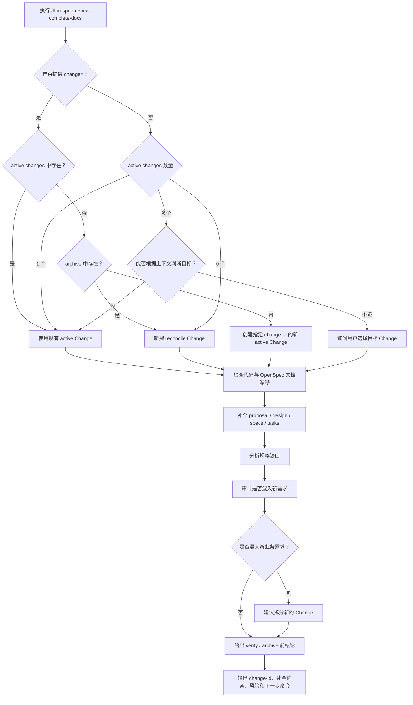

# lhm-spec-review

## 目的

`lhm-spec-review` 是一个面向 OpenSpec 项目的规范审查 Skill，用来解决“代码已经变了，但文档没有同步”的问题。

它覆盖两个场景：

- **Change 没有归档**：直接在当前 active Change 里补充 proposal、design、specs 和 tasks。
- **Change 已经归档**：不修改历史归档 Change，自动新建 reconcile Change，把当前代码和用户确认结果同步回文档。

## 作用

`lhm-spec-review` 用一个入口完成文档补全：

- 检查代码与 OpenSpec 文档是否漂移。
- 判断目标 Change 是否已经归档。
- 未归档时补全现有 active Change。
- 已归档时新建 reconcile Change。
- 补全 proposal、design、specs delta 和 tasks。
- 分析规格缺口、审计范围、给出 verify/archive 前结论。

## 唯一推荐命令

配置了 command 时，直接使用：

```text
/lhm-spec-review-complete-docs
```

指定 Change：

```text
/lhm-spec-review-complete-docs change=<change-id>
```

没有配置 command 时，直接对 Agent 说：

```text
使用 lhm-spec-review skill 执行 complete-docs。
请检查当前代码和 OpenSpec 文档是否一致，并自动判断目标 Change 是否已归档。
如果 Change 没有归档，请直接在现有 active Change 中补全文档。
如果 Change 已经归档，请不要修改历史归档 Change，自动创建新的 reconcile Change。
最后输出使用的 change-id、补全内容、风险和 verify/archive 建议。
```

## 自动判断规则

执行 `complete-docs` 时：

1. 如果提供 `change=<change-id>`：
   - 在 `openspec/changes/<change-id>/` 找到：说明未归档，直接补这个 active Change。
   - 只在 `openspec/changes/archive/` 找到：说明已归档，新建 reconcile Change。
   - 两处都找不到：按新 active Change 处理，并说明将创建该目录。

2. 如果没有提供 `change`：
   - 只有一个 active Change：直接补这个 active Change。
   - 有多个 active Change：能从上下文判断就直接选择，并说明原因；无法判断才询问用户。
   - 没有 active Change：创建新的 reconcile Change。

3. 新建 reconcile Change 时，优先使用：
   - `reconcile-specs-with-code`
   - `align-specs-with-current-implementation`
   - `sync-specs-after-iteration`
   - `document-actual-behavior`
   - 如果都存在，则使用 `reconcile-specs-with-code-2`、`reconcile-specs-with-code-3` 这类序号名称。

## 执行流程图



## 输出结果

执行完成后应输出：

- 最终使用的 `change-id`
- 是更新 active Change，还是新建 reconcile Change
- 发现的代码与文档差异
- 已补全或建议补全的文件
- 是否混入新需求
- 是否可以继续 `openspec verify`
- 是否可以继续 `openspec archive`
